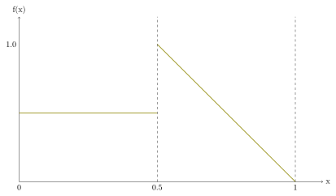
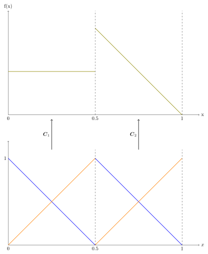
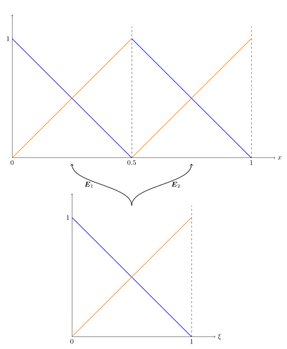
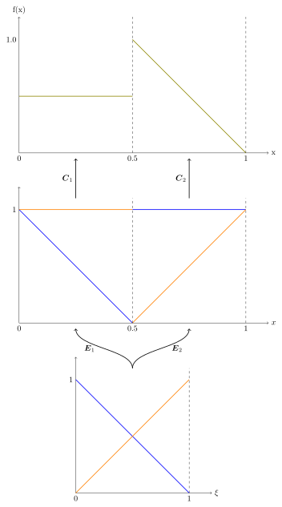
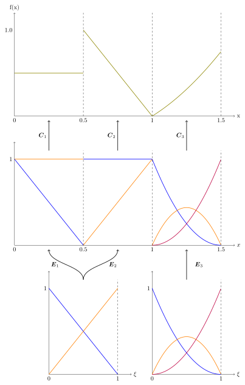

# Extraction Coefficients

In this page you will find an explanation about what *extraction coefficients* are, how they
can be used to define function spaces, and how they can be used in `Mantis`.

## Recommended Reading

Before reading this page it's advised that you have a basic understanding of **CITE FEM**.
That way, you can fully appreciate why the ideas discussed here are useful.

## [Introduction](@id ExtCoeffs-Intro)

One of the fundamental ideas in FEM is that you *discretise* a continuous problem,
converting it into a *finite-dimensional algebraic system* you can solve numerically. For
our purposes, you can think of taking a PDE and turning it into a linear system of
equations. There are usually two distinct but interconnected layers to the discretisation:

- A *computational mesh*, composed of *elements*, that represents the domain of the
  continuous problem.
- One or more finite-dimensional *function spaces* defined on the computational mesh.

A fruitful way to think about the function spaces is in terms of their *degrees of freedom*.
In essence, because we deal with finite-dimensional function spaces, we can find a similarly
finite-dimensional *basis* whose *basis functions* can be combined to represent any function
in the function space. A simple example is representing a linear function ``f(x) = 2 - 3x``. A
basis for the space of linear functions is of course ``[1, x]``. Therefore, if we choose a
*coefficient vector* ``[2, -3]^T``, we get

```math
f(x) = [1, x]
\begin{bmatrix}
    2 \\
    -3
\end{bmatrix} =
2 \cdot 1 + (-3) \cdot x =
2-3x.
```

But there is no real reason to stick with ``[1, x]`` — other than it being a natural
choice. We could have also chosen as a basis ``[1 - x, 1 + x]``, which of course means the
coefficient vector will have to be different if we still want to represent ``f``; in this
case, it would be ``[\frac{5}{2}, -\frac{1}{2}]^T``. With this we get
```math
f(x) = [1 - x, 1 + x]
\begin{bmatrix}
    \frac{5}{2} \\
    -\frac{1}{2}
\end{bmatrix} =
\frac{5}{2} \cdot (1 - x) + \left(-\frac{1}{2}\right) \cdot (1 + x) =
2-3x.
```
The key takeaway is that given a basis ``\boldsymbol{B} = [B_1, B_2,\dots]``, we can use a
coefficient vector ``\boldsymbol{C} = [c_1, c_2, \dots]^T`` to represent any function ``f`` in
the span of ``\boldsymbol{B}`` by ``f = \boldsymbol{B}\boldsymbol{C}``.

### Classical FEM

In classical FEM, the connection between the mesh and the function spaces is quite pronounced.
It's almost always the case that degrees of freedom will be tied to some component of the
mesh. For instance, we might associate some degrees of freedom to the vertices, and others
to the edges, or faces. This is in general quite a profound idea, with important
consequences for solving PDE arising from physics problems. For example, solving for a
temperature is meaningful at points, or vertices, while solving for a density makes more
sense when using volumes. The details are beyond the scope of this page, but it is something
interesting to keep in mind.

Still in the spirit of classical FEM, we can extend the previous example to piecewise-linear
functions over a given mesh; meaning that restricted to an element of the mesh, any
function is linear.
We will consider a simple one-dimensional mesh composed of two elements: ``[0, 0.5]`` and
``[0.5, 1.0]``; we label them as ``\Omega_1`` and ``\Omega_2``. For the function, we will
define ``f(x)`` such that ``f(x)|_{\Omega_1} = 0.5`` and ``f(x)|_{\Omega_2} =
\frac{3}{2}-x``. Below is what ``f(x)`` looks like.



The difference from what we saw in the beginning of the introduction is that in each element
we will have a *local basis*. This basis works the same way as the global example we saw
before, but because our function is piecewise-linear it only makes sense to use a basis for
linear functions restricted to a given element.
So, we have

```math
    f|_{\Omega_e} = \boldsymbol{N}_e \boldsymbol{C}_e,
```
where ``\boldsymbol{N}_e`` denote the local basis at element ``e``, and ``\boldsymbol{C}_e``
the coefficient vector that pertains to the basis functions supported on element ``e``. We
can visualise it as follows:



You might have noticed that the local bases in each element are identical. Therefore, these
bases can be described in terms of a *single* basis for linear functions, that is then
linearly combined to define a new local basis in each element. We write it as such:
```math
\boldsymbol{N}_e = \boldsymbol{B} \boldsymbol{E}_{e},
```
where ``\boldsymbol{B}`` is a *canonical basis*, or *section space*, that is independent of
the element ``e``, and ``\boldsymbol{E}_e`` are the *extraction coefficients* saying how the
canonical basis is linearly combined to form a local basis at element ``e``. Here is what it
looks like for our example:



This in turn means that we can write
```math
    f|_{\Omega_e} = \boldsymbol{B}\boldsymbol{E}_{e}\boldsymbol{C}_e,
```

Putting it all together we get:



::: tip A note on efficiency 

This might seem overly complicated at first, but it is very valuable from a computational
perspective. By using extraction coefficients, the canonical basis can be computed once, and
later referenced to define the local basis on each element. This means that we replace
computing the “same” basis on each element with matrix multiplications, which is in general
much cheaper.

:::

### Generalisation

In the last figures we saw that the two local bases looked identical. This does not need to
be the case. The local basis ``\boldsymbol{N}_e`` can be different across elements. This is
also a powerful realisation. By using this framework, we can use the same canonical
basis to define completely different local bases. As we will see later using `Mantis`, this
makes it possible to change the inter-element smoothness of our global basis without
changing the canonical basis.

Finally, we can generalise this even further. We might want multiple canonical basis, which
are then linearly combined to define local bases in whatever combination we choose. Below is
an example of what this might look like if we extend our example so that ``f`` is quadratic
over a new element ``\Omega_3 \coloneqq [1.0, 1.5]``




## [Implementation in `Mantis`](@id ExtCoeffs-Implementation)

::: tip Note

The details that follow are low-level in the `Mantis` framework. The only real reason you
would have to use `ExtractionOperator` directly is when implementing your own function
space. Even then, it is very unlikely that you will be tweaking each matrix manually as will
be done below. The following examples serve only to showcase what information the structure
encodes.

:::

In `Mantis`, all the information pertaining to the extraction-coefficient framework is
implemented in two structures:
-  [`Indices`](@ref)
- [`ExtractionOperator`](@ref)

We will now consider a more general case than in the [`Introduction`](@ref ExtCoeffs-Intro):
*multi-component function spaces*. Another common name for these types of spaces is vector
fields.

::: details An example of a multi-component space

A simple example is a direct-sum space in two dimensions: Given two function spaces ``A:
\Omega \to \mathbb{R}, B: \Omega \to \mathbb{R}``, we can define the direct-sum space ``A
\oplus B: \Omega \to \mathbb{R}^2`` by

```math
    A \oplus B \coloneqq \left\{(f, g): f\in A, g\in B  \right\}.
```

Then given ``(f, g) \in A\oplus B``, we have ``(f, g)(x) = [f(x), g(x)]^T``.

:::

### `Indices`

On a given element, not all global basis functions are supported — only those whose support
has a non-empty intersection with the element. The `Indices` struct tracks which global
basis functions are active on an element, and in what order they appear when the canonical
basis is evaluated. Concretely, it stores:

- `I`: a vector of *global* indices ``[i_1, i_2, \dots]`` identifying the basis functions
  that are supported on the element. This is used to assemble element contributions into the
  global system.
- `J`: an `NTuple` with one entry per component of the space. Each entry is a permutation
  that encodes how the *local* basis functions are arranged into the *global* bases at a
  given element and component.
  
::: details Permutation `J`

The permutation operator `J` is useful when defining multi-component spaces that can not be
written as direct-sum spaces. In these cases, it is necessary to define how the *local*
bases from a given component contribute to the *global, multi-component* basis — possibly
contributing to multiple components.

:::

You can find the full details at [`FunctionSpaces.Indices`](@ref).

### `ExtractionOperator`

The `ExtractionOperator` aggregates all element-level data for a function space:

- `extraction_coefficients`: a length-`num_elements` vector. Each entry is an
  `NTuple{num_components}` of matrices: one matrix ``\boldsymbol{E}_e^{(k)}`` per
  component ``k``. The matrix encodes how a canonical basis ``\boldsymbol{B}_e`` is
  linearly combined to form the local basis on element ``e`` for component ``k``:
  ```math
  \boldsymbol{N}_e^{(k)} = \boldsymbol{B}_e\,\boldsymbol{E}_e^{(k)}.
  ```
  Remember: It is possible that a permutation with `J` occurs.
- `basis_indices`: a length-`num_elements` vector of `Indices` objects, one per element.
- `num_elements`: the total number of elements.
- `num_basis`: the global dimension of the function space — or number of degrees of freedom.

You can find the full details at [`FunctionSpaces.ExtractionOperator`](@ref).

### Interface

To avoid having to directly access fields of `ExtractionOperator`, `Mantis` provides a small
set of “getters”:

| Method | Returns |
|:---------------------------------------------------------------|:----------------------------------------------------------------------------------------------------------------|
| [`FunctionSpaces.get_extraction(space, element_id, component_id)`](@ref) | `(E_e, J)` — the extraction coefficient matrix and permutation indices for element `element_id` and component `component_id` |
| [`FunctionSpaces.get_extraction_coefficients(space, element_id, component_id)`](@ref) | ``\boldsymbol{E}_e^{(k)}`` |
| [`FunctionSpaces.get_basis_indices(space, element_id)`](@ref) | global index vector `I` for that element |
| [`FunctionSpaces.get_basis_permutation(space, element_id, component_id)`](@ref) | local permutation `J` for that element and component |
| [`FunctionSpaces.get_num_basis(space)`](@ref) | total number of degrees of freedom |
| [`FunctionSpaces.get_num_basis(space, element_id)`](@ref) | number of basis functions supported on an element |


### Putting it together

To evaluate the global basis on element `element_id` at a set of points `xi`, `Mantis`
executes the following steps (see [`FunctionSpaces.evaluate`](@ref) for the details):

- __Get support indices__: `I = get_basis_indices(space, element_id)` identifies the
   columns of the global evaluation matrix that this element contributes to.
- __Loop over components__: For each component ``k``:
    - Retrieve the stored ``(\boldsymbol{E}_e^{(k)},\, J^{(k)}) =
      \texttt{get\_extraction}(\ldots)``.
    - Evaluate the canonical basis ``\boldsymbol{B}_e`` on the reference element.
    - Compute the local basis evaluations via the matrix product
      ``\boldsymbol{B}_e\,\boldsymbol{E}_e^{(k)}``.
    - Place the result into the columns selected by ``J^{(k)}``.
- __Return__: The evaluated global bases with the global support indices `I`.

This design keeps the canonical-basis evaluations element-agnostic (they are computed once
on a canonical domain) while all element-specific information is encoded in the
`ExtractionOperator` data structure.

### Example: inspecting the extraction operator

We will use as canonical basis the quadratic Bernstein polynomials.

```@example ExtCoeffs
using Mantis #hide
using CairoMakie #hide
using DisplayAs #hide

bern = FunctionSpaces.Bernstein(2)
xi = LinRange(0, 1, 50)
points = Points.PointSet(xi)
bern_eval = FunctionSpaces.evaluate(bern, points, 0)[1][1]
nothing #hide
```

```@setup ExtCoeffs
fig = Figure()
ax = Axis(
    fig[1, 1];
    title=L"\text{Bernstein Basis}",
    xlabel=L"x",
    ylabel=L"B_i(x)",
    xticks=([0.0, 1.0]),
)
for bi in 1:3
    lines!(ax, xi, bern_eval[:, bi]; label=L"B_%$(bi)")
end

axislegend(ax; unique = true, merge = true)
```

```@example ExtCoeffs
DisplayAs.Text(DisplayAs.PNG(fig)) #hide
```

We can then use this canonical basis to create a `BSplineSpace` on a 5-element geometry, by
specifying the inter-element regularity.

```@example ExtCoeffs
const geo = Geometry.create_cartesian_box((0.0,), (1.0,), (5,))
bsp = FunctionSpaces.BSplineSpace(geo, bern, [-1, 0, 1, -1, 1, -1])
nothing #hide
```

The inter-element regularity vector `[-1, 0, 1, -1, 1, -1]` is specifying how smooth the
B-Spline space is across element interfaces. With our choice, our functions will be:
``C^0``-smooth between the first and second elements; ``C^{1}``-smooth between the second and
third elements; ``C^{-1}``-smooth across the third and fourth elements, and so forth.
We can confirm this in the next figure:

```@setup ExtCoeffs
function plot_basis(space)
    cmap = Makie.cgrad(:tab10)
    fig = Figure()
    ax = Axis(
        fig[1, 1];
        title=L"\text{B-Spline Basis}",
        xlabel=L"x",
        ylabel=L"N_i(x)",
        xticks=([0.0, 0.2, 0.4, 0.6, 0.8, 1.0]),
    )
    for element in 1:Geometry.get_num_elements(geo)
        xs = Geometry.evaluate(geo, element, points)[:, 1]
        space_eval, I = FunctionSpaces.evaluate(space, element, points)
        for (local_idx, global_idx) in enumerate(I)
            lines!(ax, xs, space_eval[1][1][1][:, local_idx]; label=L"N_{%$(global_idx)}",
                color=cmap[global_idx])
        end
    end

    axislegend(ax; unique=true, merge=true)
    DisplayAs.Text(DisplayAs.PNG(fig))
end
```

```@example ExtCoeffs
plot_basis(bsp) #hide
```

Now we start by looking at what `FunctionSpaces.get_extraction` gives us for the first
element.
```@example ExtCoeffs
E₁, J₁ = FunctionSpaces.get_extraction(bsp, 1);
@show E₁ #hide
@show J₁ #hide
nothing #hide
```

This is telling us the extraction coefficients at the first element are just an identity
matrix, and that the permutation is trivial — the bases are in the correct order. This is
not a very exciting scenario, so let's look at the third element

```@example ExtCoeffs
E₃, J₃ = FunctionSpaces.get_extraction(bsp, 3)
bk = deepcopy(E₃) #hide
@show E₃ #hide
@show J₃ #hide
# To avoid floating point approximations #hide
E₃[1,1] = 0.5 #hide
E₃[1,2] = 0.5 #hide
nothing #hide
```

The extraction looks a bit more interesting now, and there are a few things we can do with
it:

::: warning Changing coefficients

Changing coefficients manually like we are about to do can be quite disastrous, as you will
soon see.

:::

:::tabs

== Change 1

We can change the coefficients of ``N_5`` so that it is constant across the element.

```@example ExtCoeffs
E₃[:,2] .= 0.5
plot_basis(bsp) #hide
```

```@setup ExtCoeffs
E₃ .= bk
```

== Change 2

We can change the coefficients of ``N_6`` to highlight the discontinuity at ``x=0.6``.

```@example ExtCoeffs
E₃[3,3] = 0.75
plot_basis(bsp) #hide
```

```@setup ExtCoeffs
E₃ .= bk
```

:::

::: warning Changing coefficients

Take a moment to notice that changing the coefficients of ``N_5`` did two, possibly
catastrophic, things:

1. By making ``N_5`` constant on the third element, it means we no longer have a local basis
   for quadratics.

2. The smoothness between the second and third elements also changed from ``C^1`` to
   ``C^0``.

One should always be careful when defining, or changing, extraction coefficients!

:::

Notice that in the changes above we changed the *local* index of the extraction operator
corresponding to a certain *global* index.

To see what the global indices are at the third element we can call `get_basis_indices`:

```@example ExtCoeffs
FunctionSpaces.get_basis_indices(bsp, 3)
```

We can see that the basis functions supported on this element are the ones labelled
`[4,5,6]`; this is what we expected from the labels in the plots.

Another thing we could do is change how the basis functions are numbered. Let's see what we
get
```@example ExtCoeffs
op = FunctionSpaces.get_extraction_operator(bsp)
op.basis_indices[3] = FunctionSpaces.Indices(5:7, (1:3,))
nothing #hide
```

There are a few things going on, so we should break it down:

1. We assign to `op` the *global* extraction operator of `bsp`. Recall that this is the one
   with all the extraction information at every element.
2. `op.basis_indices[3]` refers to `Indices` object of the third element.
3. We assign to `op.basis_indices[3]` a new `Indices` object with global numbering `5:7`
   and a trivial permutation `1:3`.

We essentially shifted the numbering at the third element from `4:6` to `5:7`. Now our bases
look like this:

```@example ExtCoeffs
plot_basis(bsp) #hide
```


## [Conclusion](@id ExtCoeffs-Conclusion)

As we saw, a framework using extraction coefficients can make defining very complex function
spaces *efficient*, *generic* and *structured*. The possibilities are quite vast: you can
make any linear combinations you want from a predetermined set of canonical basis functions.
