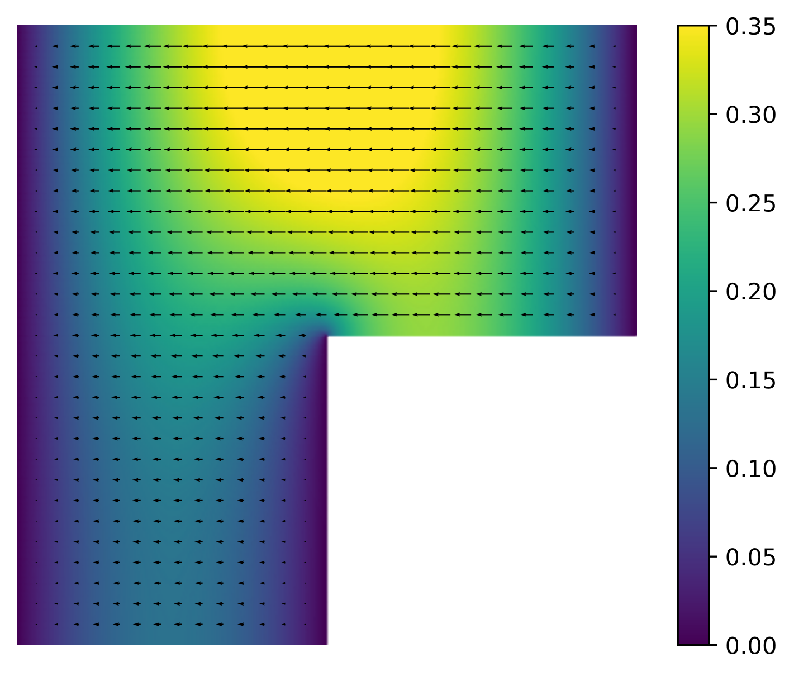
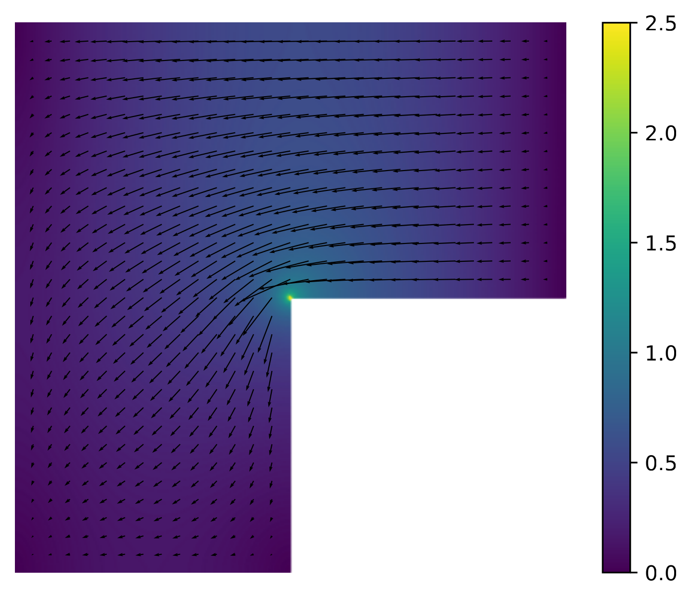

# Finite Element Exterior Calculus (FEEC)

While the discretization of the weak form of the Poisson problem presented in the previous section is relatively straightforward, the same cannot be said for mixed weak problems associated with PDEs such as the (scalar/vector) Poisson problem, the Maxwell eigenvalue problem, or the incompressible (Navier-)Stokes equations.
FEEC provides a unified framework for discretizing such problems: it gives a systematic way to construct stable finite element discretizations for a wide class of mixed problems, including those listed above.

## A motivating example: Vector Laplacian on an L-shaped domain

To motivate why ad hoc discretizations can fail, and why FEEC provides the right framework for designing stable ones, consider the **vector Laplacian** problem on an L-shaped domain ``\Omega \subset \mathbb{R}^2``: find ``\mathbf{u}`` such that

```math
\begin{align*}
-\Delta \mathbf{u} &= \mathbf{f} \quad \text{in } \Omega\;,\\
\mathbf{u} \cdot \mathbf{n} &= 0 \quad \text{on } \partial\Omega\;,\\
\nabla \times \mathbf{u} &= 0 \quad \text{on } \partial\Omega\;.
\end{align*}
```

### The primal formulation and its failure

A natural first attempt is to perform a conforming discretization of the primal weak form: find ``\mathbf{u}_h \in V_h \subset H(\text{curl}; \Omega) \cap \mathring{H}(\text{div}; \Omega)`` such that

```math
(\nabla \cdot \mathbf{u}_h, \nabla \cdot \mathbf{v}_h) + (\nabla \times \mathbf{u}_h, \nabla \times \mathbf{v}_h) = (\mathbf{f}, \mathbf{v}_h) \quad \forall \mathbf{v}_h \in V_h\;,
```
where ``V_h`` is some finite dimensional space of piecewise-polynomial vector fields (e.g., continuous piecewise polynomials), ``H(\text{curl};\Omega)`` is the space of vector fields with square-integrable curls, and ``\mathring{H}(\text{div};\Omega)`` is the space of vector fields with square-integrable divergences and vanishing (normal) trace.

Such a discretization fails on the L-shaped domain: the discrete solution lives in a proper closed subspace of ``H(\text{curl}; \Omega) \cap \mathring{H}(\text{div}; \Omega)``, producing spurious modes that persist under mesh refinement.



### The mixed formulation and its success

The correct approach, guided by FEEC, is to use a **mixed formulation**: find ``(\sigma_h, \mathbf{u}_h) \in V_h^0 \times V_h^1`` such that

```math
    \begin{align*}
        (\sigma_h, \tau_h) - (\mathbf{u}_h, \nabla \tau_h) &= 0 \quad \forall \tau_h \in V_h^0,\\
        (\nabla \sigma_h, \mathbf{v}_h) + (\nabla \times \mathbf{u}_h, \nabla \times \mathbf{v}_h) &= (\mathbf{f}, \mathbf{v}_h) \quad \forall \mathbf{v}_h \in V_h^1,
    \end{align*}
```
where ``V_h^0`` is an ``H^1``-conforming space and ``V_h^1`` is an ``H(\text{curl})``-conforming space (e.g., Nédélec edge elements, or B-spline generalizations of the edge elements).
The spaces ``V_h^0`` and ``V_h^1`` need to be chosen in a "compatible" manner (in the sense described in the following sections), but when they are, the discrete solution converges to the true solution, and we avoid the issues associated with the primal formulation.
Note that this is true even when ``V_h^1`` is an appropriately chosen ``H^1``-conforming space (e.g., that of ``C^1`` smooth B-spline edge elements): the key difference from the primal formulation is that now the ``H(\text{curl};\Omega)``-norm restricted to such spaces is not equivalent to the ``H^1`` norm.



This example illustrates the central lesson of FEEC: the choice of discrete spaces must respect the structure underlying the PDEs being solved.
For the scalar and vector Laplacians in three dimensions, this structure is encoded in the de Rham complex, introduced in the following.

## The de Rham Complex in 3 Dimensions

Assume we are working on domains ``\Omega \subset \mathbb{R}^3``.
The Sobolev spaces that appear in mixed discretizations of scalar/vector Laplacians can be connected into a sequence using the differential operators of the weak forms:

```math
0 \xrightarrow{} H^1(\Omega) \xrightarrow{\nabla} H(\text{curl}; \Omega) \xrightarrow{\nabla \times} H(\text{div}; \Omega) \xrightarrow{\nabla \cdot} L^2(\Omega) \xrightarrow{} 0\;.
```

where:
*   ``H^1(\Omega)`` is the space of scalar functions with square-integrable gradients;
*   ``H(\text{curl}; \Omega)`` is the space of vector fields with square-integrable curls;
*   ``H(\text{div}; \Omega)`` is the space of vector fields with square-integrable divergences;
*   ``L^2(\Omega)`` is the space of square-integrable scalar functions.

This sequence is called a **complex** because the composition of any two successive differential operators is trivial:

```math
    \nabla \times \nabla \equiv 0\;,\;\nabla \cdot \nabla \times  \equiv 0\;.
```

Moreover, the following quotient spaces are intimately connected to the topological structure of ``\Omega``:

```math
    \begin{align*}
    \mathcal{H}^0 &:= \ker(\nabla)\;,\\
    \mathcal{H}^1 &:= \ker(\nabla \times) / \text{im}(\nabla)\;,\\
    \mathcal{H}^2 &:= \ker(\nabla \cdot) / \text{im}(\nabla \times)\;,\\
    \mathcal{H}^3 &:= L^2(\Omega) / \text{im}(\nabla \cdot)\;.
    \end{align*}
```

These spaces are called the **cohomology spaces** of the de Rham complex, and the dimension of ``\mathcal{H}^i`` is equal to the ``i``-th Betti number of ``\Omega``, i.e., the number of ``i``-dimensional holes in ``\Omega``. For example, if ``\Omega`` is a solid ball with a spherical cavity, then ``\dim(\mathcal{H}^0) = 1``, ``\dim(\mathcal{H}^1) = 0``, ``\dim(\mathcal{H}^2) = 1`` and ``\dim(\mathcal{H}^3) = 0``.
For the purpose of our discussion, let us assume that ``\Omega`` is (topologically) a solid ball, so that ``\dim(\mathcal{H}^0) = 1`` and ``\dim(\mathcal{H}^1) = \dim(\mathcal{H}^2) = \dim(\mathcal{H}^3) = 0``. In this case, the complex is said to be **exact**.

## Mixed Laplacians associated to the de Rham complex

The theory of Hilbert complexes allows us to study the well-posedness of the mixed weak forms of scalar and vector Laplacians.
Let us introduce some useful notation to illustrate this:
*   ``V^0 = H^1``, ``d^0 = \nabla``
*   ``V^1 = H(\text{curl})``, ``d^1 = \nabla \times``
*   ``V^2 = H(\text{div})``, ``d^2 = \nabla \cdot``
*   ``V^3 = L^2``.

Then, the de Rham complex can be equivalently written as:

```math
0 \xrightarrow{} V^0 \xrightarrow{d^0} V^1 \xrightarrow{d^1} V^2 \xrightarrow{d^2} V^3 \xrightarrow{} 0\;.
```

Using this notation, and since we are working with an exact complex, it can be shown that the following (mixed) weak problem is well-posed for all ``i \in \{0, 1, 2, 3\}`` (where ``V^{-1} := \{0\}`` by convention): find ``(\sigma, u, p) \in V^{i-1} \times V^{i} \times \mathcal{H}^i`` such that

```math
    \begin{equation}
    \begin{split}
        (\sigma, \tau) - (u, d^{i-1}\tau) &= 0 \quad \forall \tau \in V^{i-1},\\
        (d^{i-1}\sigma, v) + (d^i u, d^i v) + (p, v) &= (f, v) \quad \forall v \in V^i,\\
        (u, q) &= 0 \quad \forall q \in \mathcal{H}^{i}.
    \end{split}
    \end{equation}
```

This is a useful and elegant way to express four different problems at the same time.
For instance, when ``i = 0``, since ``V^{-1} = \{0\}`` the ``\sigma`` equation vanishes, and we recover the standard Poisson problem discussed in the previous section (albeit now with homogeneous natural boundary conditions): find ``(u, p) \in H^1(\Omega) \times \mathbb{R}`` such that

```math
    \begin{align*}
        (\nabla u, \nabla v) + (p, v) &= (f, v) \quad \forall v \in V^0,\\
        (u, q) &= 0 \quad \forall q \in \mathbb{R},
    \end{align*}
```

where we have used the fact that ``\mathcal{H}^0 = \ker(\nabla) = \mathbb{R}``.

Similarly, for ``i = 3``, we have the mixed form of the scalar Poisson problem: find ``(\sigma, u) \in H(\text{div}; \Omega) \times L^2(\Omega)`` such that

```math
    \begin{align*}
        (\sigma, \tau) - (u, \nabla \cdot \tau) &= 0 \quad \forall \tau \in H(\text{div}; \Omega),\\
        (\nabla \cdot \sigma, v)&= (f, v) \quad \forall v \in L^2(\Omega).
    \end{align*}
```

## Discretizations using FEEC

FEEC provides guiding principles for discretizing problems of the form introduced above. The main idea is that when we discretize the spaces in the de Rham complex using finite elements, we should not just approximate individual spaces, but we should construct a **discrete subcomplex** that approximates the continuous complex while preserving its cohomological structure.
Let us denote such a discrete subcomplex as:

```math
0 \xrightarrow{} V_h^0 \xrightarrow{d^0} V_h^1 \xrightarrow{d^1} V_h^2 \xrightarrow{d^2} V_h^3 \xrightarrow{} 0
```

FEEC then states that, if there exist bounded cochain projection operators ``\pi_h^i : V^i \to V_h^i`` for all ``i \in \{0, 1, 2, 3\}`` (see [Arnold2010] for details), then the following discrete problem is well-posed for all ``i \in \{0, 1, 2, 3\}``: find ``(\sigma_h, u_h, p_h) \in V_h^{i-1} \times V_h^i \times \mathcal{H}_h^i`` such that

```math
    \begin{equation}
        \begin{split}
            (\sigma_h, \tau_h) - (u_h, d^{i-1}\tau_h) &= 0 \quad \forall \tau_h \in V_h^{i-1},\\
            (d^{i-1}\sigma_h, v_h) + (d^i u_h, d^i v_h) + (p_h, v_h) &= (f, v_h) \quad \forall v_h \in V_h^i,\\
            (u_h, q_h) &= 0 \quad \forall q_h \in \mathcal{H}_h^i.
        \end{split}
    \end{equation}
```

This is a very powerful result that can be applied to Hilbert complexes that are more general than the de Rham complex, and used to construct stable finite element discretizations for a wide class of associated problems.

## Differential forms and generalization to arbitrary dimensions

The vector-proxy presentation above is convenient in three dimensions, but the underlying structure extends naturally to domains ``\Omega \subset \mathbb{R}^n`` for any ``n``. The proper language for this generalization is that of **differential forms**: loosely, a ``k``-form is an object that can be integrated over ``k``-dimensional surfaces, and the exterior derivative ``d`` generalizes the classical operators ``\nabla``, ``\nabla \times``, and ``\nabla \cdot`` in a dimension-independent way. The de Rham complex then takes the form

```math
0 \xrightarrow{} H\Lambda^0(\Omega) \xrightarrow{d} H\Lambda^1(\Omega) \xrightarrow{d} \cdots \xrightarrow{d} H\Lambda^n(\Omega) \xrightarrow{} 0\;,
```

where ``H\Lambda^k(\Omega)`` denotes the space of ``k``-forms with square-integrable exterior derivatives. For a precise treatment we refer the reader to [Arnold2010].

In dimensions ``n \leq 3``, the spaces ``H\Lambda^k(\Omega)`` are isomorphic to the familiar vector-proxy spaces: ``H\Lambda^0 \cong H^1``, ``H\Lambda^1 \cong H(\text{curl})``, ``H\Lambda^2 \cong H(\text{div})``, and ``H\Lambda^3 \cong L^2``, with the exterior derivative corresponding to ``\nabla``, ``\nabla\times``, and ``\nabla\cdot`` respectively. Mantis adopts the differential-form language throughout in order to keep the notation dimension-independent and consistent with the FEEC literature.
